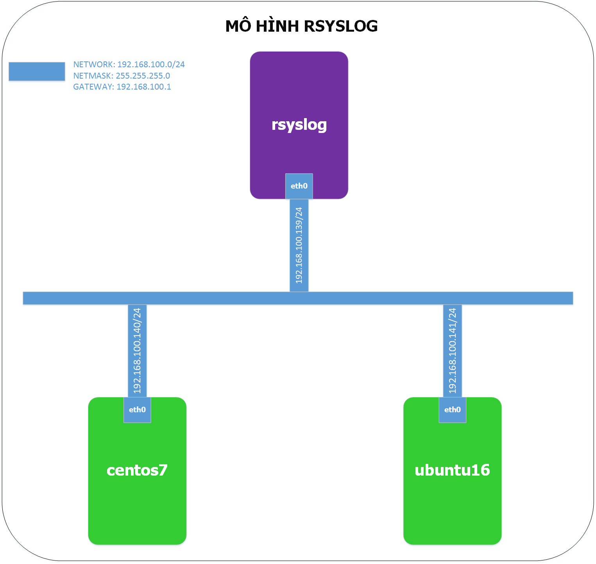
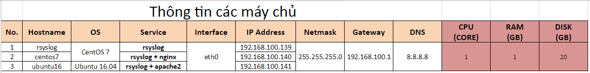
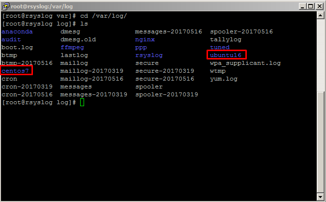
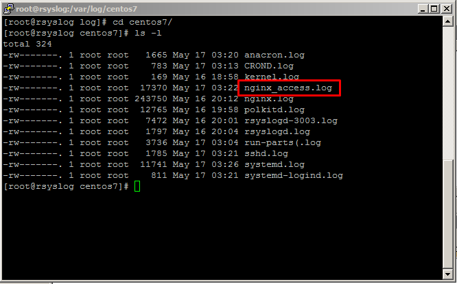
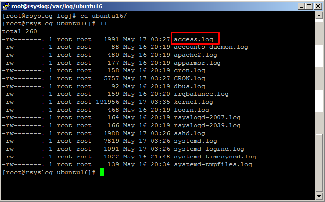

# Hướng dẫn đẩy log của Apache2 (Ubuntu) và Nginx (CentOS) về rsyslog

### Menu

- [1. Giới thiệu](#1)
- [2. Cấu hình](#2)
	- [2.1 Cấu hình Server nhận log - rsyslog](#21)
	- [2.2 Cấu hình Server đẩy log](#22)
		- [2.2.1 Cấu hình trên Server sử dụng Apache2 (Ubuntu)](#221)
		- [2.2.2 Cấu hình trên Server sử dụng Nginx (CentOS)](#222)
- [3. Kiểm tra](#3)

<a name="1"></a>
## 1. Giới thiệu

**Rsyslog** là một gói phần mềm trong hệ thống Linux nhằm để ghi bản tin log của hệ thống trong quá trình hoạt động như của kernel, deamon, cron, auth, hoặc các ứng dụng chạy trên hệ thống như HTTP, DNS, SSH,...

### Mô hình cài đặt



### IP Planning



<a name="2"></a>
## 2. Cấu hình

<a name="21"></a>
### 2.1 Cấu hình Server nhận log - rsyslog

Trên server `rsyslog`, chúng ta cấu hình như sau:

- **Bước 1**: Cho rsyslog lắng nghe qua port 514/UDP

```
sed -i '/$ModLoad imudp/ s/^#*//' /etc/rsyslog.conf
sed -i '/$UDPServerRun 514/ s/^#*//' /etc/rsyslog.conf
```

- **Bước 2**: Phân loại log của mỗi host vào từng folder (tên folder là HOSTNAME)

```
echo -e "\$template TmplAuth,"/var/log/%HOSTNAME%/%PROGRAMNAME%.log"
*.* ?TmplAuth" >> /etc/rsyslog.conf
```

**Chú ý**: Tên folder có 2 dạng
- Theo HOSTNAME: %HOSTNAME%
- Theo IP: %fromhost-ip%

Nếu bạn muốn thay thế tên folder, vui lòng chỉnh sửa câu lệnh trên.

- **Bước 3**: Cấu hình tường lửa Firewalld và SELinux

Nếu server của bạn có sử dụng Firewalld, hãy mở port cho `rsyslog` bằng lệnh:

```
firewall-cmd --permanent --add-port=514/udp
firewall-cmd --reload
```

Tắt SELINUX tức thời bằng lệnh:

```
setenforce 0
```

Chỉnh sửa file cấu hình của SELinux:

```
sed -i '/SELINUX=enforcing/ s/enforcing/disabled/' /etc/selinux/config
```

<a name="22"></a>
### 2.2 Cấu hình Server đẩy log

<a name="221"></a>
#### 2.2.1 Cấu hình trên Server sử dụng Apache2 (Ubuntu)

Nếu bạn chưa cài `apache2`, vui lòng cài đặt bằng lệnh:

```
apt-get install apache2 -y
```

- **Bước 1**: Chỉnh sửa file cấu hình của `apache2`:

```
sed -i '/ErrorLog */ s/\${APACHE_LOG_DIR}\/error.log/syslog:local1/' /etc/apache2/apache2.conf 
```

Sửa tiếp file default của apache2

```
sed -i '/ErrorLog */ s/\${APACHE_LOG_DIR}\/error.log/syslog:local1/'  /etc/apache2/sites-available/000-default.conf
sed -i '/#CustomLog */ s/\${APACHE_LOG_DIR}\/access.log/"\| \/usr\/bin\/logger -taccess -plocal1.info\"/'  /etc/apache2/sites-available/000-default.conf
```
- **Bước 2**: Cấu hình `rsyslog`:

```
echo -e "*.* @192.168.100.141" >> /etc/rsyslog.d/50-default.conf
```

**Lưu ý:** Thay thế địa chỉ IP rsyslog của bạn vào câu lệnh.

Sau đó khởi động lại `apache2` và `rsyslog`

```
systemctl restart apache2
systemctl restart rsyslog
```

Cấu hình tường lửa UFW, nếu đang bật:

```
ufw allow 80/tcp
ufw reload
```

<a name="222"></a>
#### 2.2.2 Cấu hình trên Server sử dụng Nginx (CentOS)

Nếu bạn chưa cài `nginx`, vui lòng cài đặt bằng lệnh:

```
yum install -y epel-release
yum install -y nginx
```

Nếu server của bạn có sử dụng Firewalld, hãy mở port cho nginx bằng lệnh:

```
firewall-cmd --permanent --add-port=80/udp
firewall-cmd --reload
```

Tắt SELINUX tức thời bằng lệnh:

```
setenforce 0
```

Chỉnh sửa file cấu hình của SELinux:

```
sed -i '/SELINUX=enforcing/ s/enforcing/disabled/' /etc/selinux/config
```

- **Bước 1**: Chỉnh sửa file cấu hình của `nginx`:

```
sed -i '/access_log */ s/\/var\/log\/nginx\/access.log  main/syslog:server=192.168.100.141,facility=local2,tag=nginx_access,severity=info combined/' /etc/nginx/nginx.conf
```

- **Bước 2**: Cấu hình `rsyslog`:

```
echo -e "*.* @192.168.100.141" >> /etc/rsyslog.conf
```

**Lưu ý:** Thay thế địa chỉ IP rsyslog của bạn vào 2 câu lệnh trên.

Sau đó khởi động lại `nginx` và `rsyslog`

```
systemctl restart nginx
systemctl restart rsyslog
```

<a name="3"></a>
## 3. Kiểm tra

Chúng ta tạo một vài request đến 2 web server trên máy chủ `rsyslog`.

```
for x in {1..10}; do curl 192.168.100.140; curl 192.168.100.141; sleep 1; done
```

Di chuyển vào thư mục `/var/log/`, chúng ta sẽ thấy 2 thư mục mới được tạo chứa log của 2 host `centos7` và `ubuntu16`.

```
cd /var/log/
ls
```



Truy cập lần lượt vào 2 thư mục này, chúng ta sẽ thấy file log của nginx và apache được đẩy về.





### Tham khảo:

- https://github.com/hocchudong/Syslog
- https://nginx.org/en/docs/syslog.html